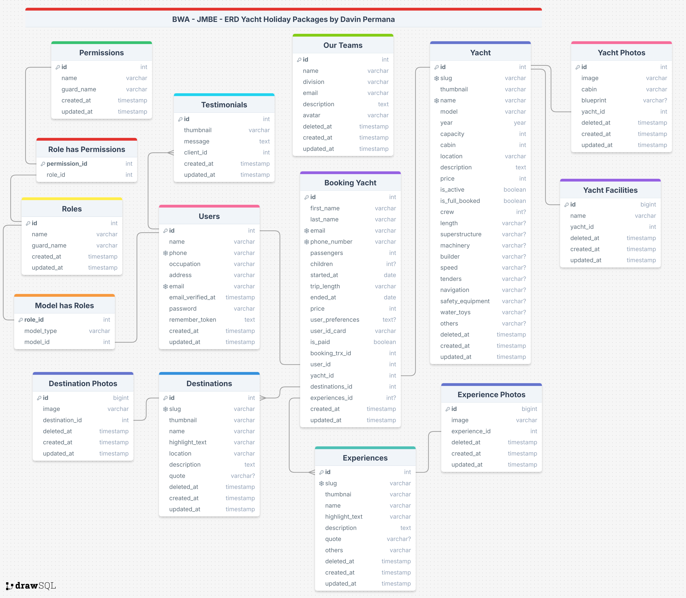

# BWA - JMBE - Yacht Holiday Packages

Welcome to the Yacht Holiday Packages project repository, a website named Indoneyacht for booking and managing holiday packages using Laravel Filament. This project is part of my internship requirements at Build With Angga as a Junior Back-End Developer.

## Project Overview

The Yacht Holiday Packages project aims to create a user-friendly website that allows users to browse and book various holiday packages. The platform will feature a robust database design, implemented using Entity-Relationship Diagrams (ERDs), to store and manage holiday packages, destinations, and user booking transaction.
Technologies Used

### Technologies Used

-   Laravel 11 as a full-stack framework
-   Filament for make admin dashboard
-   Spatie Role Permission
-   CSS Vanilla for design the website

## Features

-   User registration, login system, and forgot password
-   Desktop view support for great experience
-   Admin dashboard for managing bookings and profiles
-   Holiday package search and filtering by destination, duration, and price
    Package details page with images, description, and reviews on Admin Panel
-   User Booking dashboard on Admin Panel
-   Administrator dashboard for managing holiday packages, destinations, and user information

## Technical Requirements

-   Laravel 11 as the Fullstack framework
-   Laravel Filament for building the admin dashboard
-   MySQL as the database management system

## ERD Diagram

<p align="center"><a href="https://drive.google.com/file/d/1l50MWqBBNJYdFRFP-7KiIMX-udgxXEKQ/view?usp=drive_link" target="_blank"></a></p>
or used this link: https://drive.google.com/file/d/1l50MWqBBNJYdFRFP-7KiIMX-udgxXEKQ/view?usp=drive_link
The diagram illustrates the relationships between the various entities, including holiday packages, destinations, users, and bookings.

## Getting Started

-   Clone the repository using git clone

```bash
  git clone https://github.com/Davinprm/BWA-MJBE-Holiday-Packages.git
```

-   Install the required dependencies using composer install

```bash
  composer install
```

-   Configure the database settings in the .env file

-   To generate the encryption key

```bash
php artisan key:generate
```

-   Run the migration scripts using php artisan migrate

```bash
  php artisan migrate
```
- or migrate:refresh if you can not make user

```bash
  php artisan migrate:refresh
```

-   Make user for accessing admin panel

```bash
php artisan make:filament-user
```

-   Start the development server using php artisan serve

```bash
  php artisan serve
```

-   And go straight to the link /home

## Acknowledgments

I would like to extend my sincere gratitude to Build With Angga for providing me with the opportunity to apply for the Junior Back End internship.
